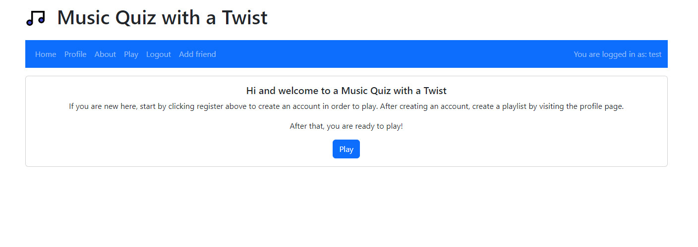

# User Evaluation

Everyone in our group choose one person and did a user evaluation in the form of a think aloud evaluation. We have added the label "User Evaluation" on every issue that addresses any of the feedback we recieved in this process. At the bottom of this document you can see images of our application before and after user evaluation.

## Feedback

This is all feedback from the think aloud evaluation. A checkmark means that we have taken the feedback into account and done something to enhance the user experience with ragards to the feedback. It is also explained what was changed.

### Anna - 15 min

- [x] Remove "You are not logged in/You are loged in as \<name\>" and put the login/register-buttons there instead. When logged in, the logout-button can be there.
  - We have removed the text in the navbar and changed location of the Login, Register, and Logout buttons. The name of the user is now displayed in the navbar next to its profile picture.
- [x] When regestering you are not redirected to another page. Would be good to be redirected to another page, could have a popup that states that registering went through, and when it disappears being redierected to some other page.
  - The user is now redirected to their profile on successful registration.
- [x] The play-button in the navbar should “stand out” more, it was easy to miss.
  - We changed the color of the navbar items to white, maikng them easier to read.
- [x] Difficult to know what to do when entering play page and not having any playlist to select. Would be nice to let the user know where they can add a new playlist, or maybe have a button that redirects the user to the create-profile page.
  - We added a description on the home page about how to use the app.
- [ ] 10 songs minimum is a bit too much, especially if you want to try the game out easily
- [ ] Would be nice if there were an easy way to test the game without registering a user.
- [x] Should probably let the user know if they have not selected a playlist when trying to play the game without a playlist
  - We aded an alert that pops up when trying to play the game without a playlist selected.
- [ ] Sometimes the loading of a game takes very long time..
- [x] It is easy to miss the sidebar tab, we need to make it more clear that it is clickable - perhaps shade the tab or write some text.
  - We made the button mre visible and changed the icon. We also wrote a short sentence on the profile how to find your friends.

### Asta - 20-30 min

- [x] The words on the Navbar are pale, which makes them hard to read
  - We changed the color of the navbar items to white. Now they are more visible.
- [x] The text on the home page is a bit confusing. Should I click play or register?
  - We added some text on the homepage explaining how to use the app.
- [x] The register box on the register page is very far down
  - The register box is now more centered.
- [x] After logging in, maybe you should redirect to home or profile? (currently we are still on register page.
  - We redirect to another page once you log in or register now.
- [x] If you register and then log out the register page is still present with a the page saying you have been registered. kind of confusing.
  - Now you get redirected elsewhere when you register/login.
- [x] When you log in you redirect to an empty page.
  - We chnged so that you redirect to the game.
- [x] He asked how to add friends after having looked at the sidebar. It was empty and just said friends. Maybe add message “You have no friends. Do this to get friends”
  - Now a button "+ Add Friend" is there on the sidebar redirecting you to the add friend page.
- [ ] 10 songs a bit too much when creating a playlist
- [x] A number showing how many songs you have added would be nice
  - A number that shows how many sings you have in your playlist has been added.
- [ ] It is not obvious that you can press the dropdown button on the playlist (he didn’t do it)
- [ ] When on the phone the hamburger menu is not closed when you press a link
- [ ] He asked what the point with the game is when he had started the game. He didn’t understand if you were supposed to answer as fast as possible or just get the right answer
- [ ] He didn’t understand what game speed meant when configuring the game until he had played once.
- [x] When he played the same playlist again he got the same songs and answers. Would be nice if it was different so that you can replay
  - A better random was choosen and used for the game.
- [x] The game timer broke the game
  - The game timer has been removed and now you press a button to go to the next question instead of havng to wait.
- [x] Nice if you could close the game? A button for that maybe?
  - An exit button has been added to the game.

### Marcus - 15 min

- [x] It is hard to figure out where to go after you have logged in. Maybe add some text to show that you should login and create a playlist, which you can then play in the quiz.
  - The home page now has some info about the page.
- [x] The sidebar is very hidden and hard to find.
  - The design has been changed to make it more visible. A text has also been added to the profile page explaining where you can find your friends.
- [x] It would be nice to have the ability to see how many questions you have left in the quiz. Now, you don’t really know how much of the quiz you have left when playing.
  - A bar showing how many questions the quiz has as well has been added. It also changes color on the questions you have answered (red for wrong, green for correct).
- [x] The text “Which song are you hearing?” should probably be on the top of the game screen not at the bottom, that would make it easier to know what to focus on (hearing) and would also make it look better.
  - The text has been moved to the top of the game.
- [x] It would be nice if you could show the profile picture in the profile view.
  - The profile piccture has been added to the profile view.
- [x] Instead of having a profile button in the navigation menu, you could have the name of the logged in user together with his/her profile picture and make that the profile button. That is how many sites do it, see Instagram, for instance.
  - A button displaying your profile picture as well as your username. The profile link is still there however
- [x] The register screen takes up too much vertical height, which enables scrolling in the browser.
  - The register screen has been fixed and is not taking up as much space.
- [x] Nothing happens when we try to start the game without selecting a playlist. Perhaps some notification should show up.
  - Now there is an alert when this happens.

### Filip - 20-30 min

- [x] The design looks boring. Looks quickly made.
  - We have created a more fun design of the application.
- [x] The fields should be emptied when logging in.
  - we are redirecting the user to another page, so this is not an issue anymore.
- [x] Implement an "about" page.
  - We have removed the about page.
- [x] Unclear that you cannot play the game without a playlist.
  - the user is now prompted with an alert if no playlist is selected when trying to play game.
- [ ] Rename the playlist to quiz.
- [ ] Search for song/artist.
- [x] Should state that there must be 10 songs before starting. Unclear how many songs are required.
  - This is now shown when creating playlists
- [x] Unclear how to get started, first create a list and then click play.
  - We have tried to improve this by imrpoving the description on the home page and for instance having a button in /play that can redirect a user to create a playlist if the user has no playlist.
- [x] Fix so that you cannot enter the game without having a playlist.
  - When a user attempts to start a game without any quiz selected, an alert informs the user that a quiz needs to be selected.
- [ ] Maybe increase the time between songs. Alternatively, choose it yourself.
- [x] More colors in the design. Larger spinner in the middle.
  - More colors is implemented, but the spinner is the same.
- [ ] Fix margin in mobile view. Fix so that it says "choose playlist" when you press start and have not made a list.
- [ ] Margins look bad when we are in the game on a mobile device. The search bar looks bad in mobile view.

## Before User Evaluation

<figure>
  
  <figcaption>The design of the application</figcaption>
</figure>

<figure>
  
  
  <figcaption>To the left: The sidebar button. Right: The sidebar expanded </figcaption>
</figure>

<figure>
  
  
  <figcaption>Images of the sidebar when logged in/out. </figcaption>
</figure>

## After User Evaluation

To be added.
